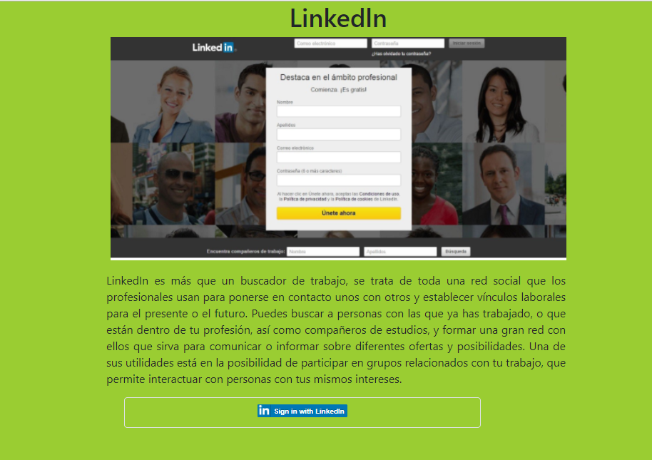

# LINKEDLN - La mayor red profesional del mundo

## Descripción

Si tú pensabas que LinkedIn solo servía para mantener actualizado tu CV, revisa las siguientes slides para que te sorprendas con todas las posibilidades que nos ofrece para crear diferentes productos.

##  Recursos utilizados

* HTML5
* CSS
* JQUERY
* Eslintrc 
* Bootstrap
* API Linkedln

## Autores

* Pamela Rojas
* Jymma Mogollon

## Archivos utilizados

* README.md con descripción del proyecto con la  API Linkedln.
* index.html: Página web.
* .eslintrc con configuración para linter.
* .gitignore para ignorar node_modules u otras carpetas que no deban incluirse en control de versiones.
* package.json con nombre, versión, descripción, autores, licencia, dependencias, scripts (pretest, test, ...)

## Producto

## Licencia

*Copyright (C) 2018 ~ * 